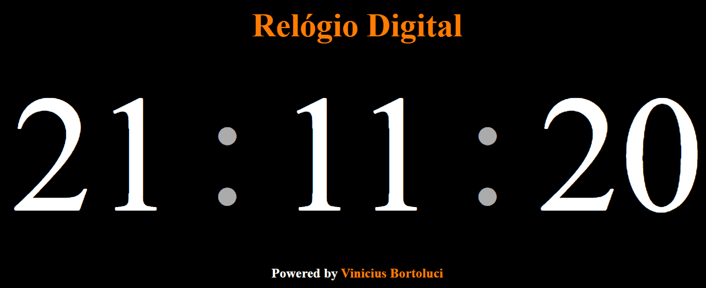

# Projeto de um relógio 
Projeto com um relogio automático bem legal, visto no canal @gutoneitzke!

# Tecnologias utilizadas:
 - HTML
 - CSS
 - JS

# Como foi feito:

 - Feita todo a arquitetura do projeto em HTML
 - Estilizado com CSS, onde foi definido todos as caracteristicas visuais do projeto
 - Entra a parte da fazer funcionar com JS, utilizando pequenas funções.

